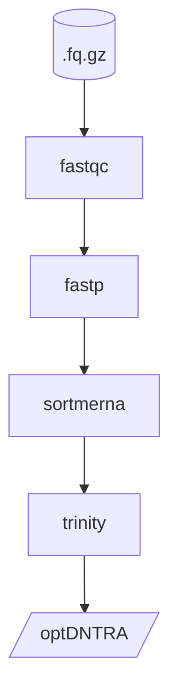

# RNA-seq pipeline

## Reference
- https://nf-co.re/rnaseq/3.9
- https://github.com/griffithlab/rnaseq_tutorial
- 转录组学 (RNA-seq)|（一）RNA-seq数据的质控与清洗 https://mp.weixin.qq.com/s/XMV1tNHECdw6YqdOVo4e_w
- RNA-seq 最佳实践系列（三）：质控——你的数据够干净吗 https://mp.weixin.qq.com/s/rqc0_1O-e6IPT-_ClhRj-Q